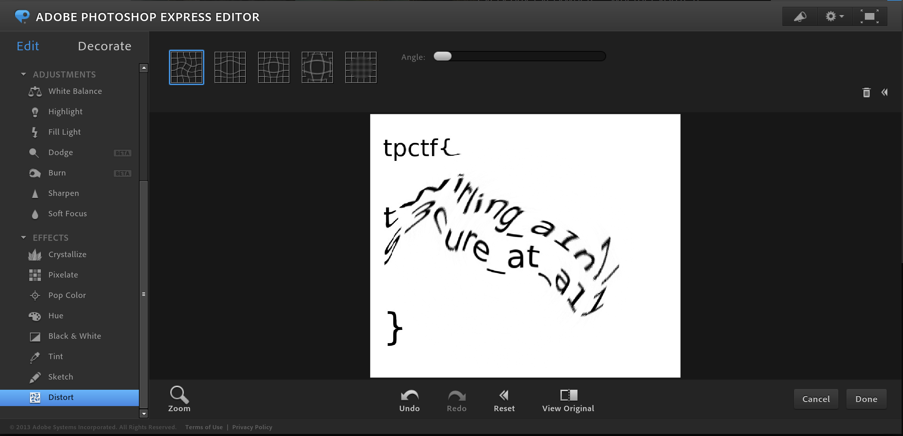

# Twirl
Steganography - 35 points

## Challenge 

>krnh12 tried to send me this image, but darn kmh11 intercepted it and twirled it around. Can you help me recover the flag?

>UPDATE: The flag has been changed, but no solves have been lost. Use the new file, twirl.jpg.

>Author: Clarence Lam

[twirl.jpg](twirl.jpg)

## Hint
> What's the opposite of twirl?

## Solution
Unswirl a photo using photoshop. You can use photoshop express online. [I followed this guide](https://www.techwalla.com/articles/how-to-unscramble-a-swirled-photo)

## Flag
`tpctf{twirling_a1n7_s3cure_at_a11}`